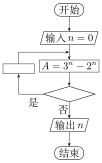

+++
title = "2017 全国Ⅰ卷理科数学试题及答案"
date = 2021-05-16T16:08:19.199Z
description = "全网最高质量，LaTeX 排版公式，tikz 重制图形"
draft = false
tags = [ "高中数学", "高考答案" ]
categories = [ "高中数学" ]
+++

  

2017 年普通高等学校招生全国统一考试

理科数学（全国Ⅰ卷）

本试卷 5 页，23 小题（含选考题）。全卷满分 150 分。考试用时 120 分钟。

<big><b>★祝考试顺利★</b></big>

**注意事项：**

1．答题前，先将自己的姓名、准考证号填写在试卷和答题卡上，并将准考证号条形码粘贴在答题卡上的指定位置。  
2．选择题的作答：每小题选出答案后，用 2B 铅笔把答题卡上对应题目的答案标号涂黑。写在试卷、草稿纸和答题卡上的非答题区域均无效。  
3．非选择题的作答：用黑色签字笔直接答在答题卡上对应的答题区域内。写在试卷、草稿纸和答题卡上的非答题区域均无效。  
4．选考题的作答：先把所选题目的题号在答题卡上指定的位置用 2B 铅笔涂黑。答案写在答题卡上对应的答题区域内，写在试卷、草稿纸和答题卡上的非答题区域均无效。  
5．考试结束后，请将本试卷和答题卡一并上交。

**一、选择题：本题共 12 小题，每小题 5 分，共 60 分。在每小题给出的四个选项中，只有一项是符合题目要求的。**

**1．** 已知集合 $A=\{x|x<1\}$，$B=\{x|3^x<1\}$，则【A】

A．$A \cap B=\{ x|x < 0\}$　　B．$A \cup B=\mathbf R$

C．$A \cup B=\{ x|x > 1\}$　　D．$A \cap B=\varnothing$

**2．** 如图，正方形 $ABCD$ 内的图形来自中国古代的太极图．正方形内切圆中的黑色部分和白色部分关于正方形的中心成中心对称．在正方形内随机取一点，则此点取自黑色部分的概率是【B】

A．$\frac14$　　B．$\frac{\pi}8$

C．$\frac12$　　D．$\frac{\pi}4$

**3．** 设有下面四个命题

$p_1$：若复数 $z$ 满足 $\frac1{z} \in \mathbf{R}$，则 $z \in \mathbf{R}$；

$p_2$：若复数 $z$ 满足 $z^2 \in \mathbf{R}$，则 $z \in \mathbf{R}$；

$p_3$：若复数 $z_1$，$z_2$ 满足 $z_1z_2 \in \mathbf{R}$，则 $z_1=\overline{z_2}$；

$p_4$：若复数 $z \in \mathbf{R}$，则 $\bar{z} \in \mathbf{R}$．

其中的真命题为【B】

A．$p_1,p_3$　　B．$p_1,p_4$　　C．$p_2,p_3$　　D．$p_2,p_4$

**4．** 记 $S_{n}$ 为等差数列 $\{ a_{n}\}$ 的前 $n$ 项和．若 $a_4+a_5=24$，$S_6=48$，则 $\{ a_{n}\}$ 的公差为【C】

A．1　　B．2　　C．4　　D．8

**5．** 函数 $f(x)$ 在 $(-\infty,+\infty)$ 单调递减，且为奇函数．若 $f(1)=-1$，则满足 $- 1 \leqslant f(x-2) \leqslant 1$ 的 $x$ 的取值范围是【D】

A．$\lbrack-2,2\rbrack$　　B．$\lbrack-1,1\rbrack$　　C．$\lbrack 0,4\rbrack$　　D．$\lbrack 1,3\rbrack$

**6．** $(1+\frac1{x^2})(1+x)^6$ 展开式中 $x^2$ 的系数为【C】

A．15　　B．20　　C．30　　D．35

**7．** 某多面体的三视图如图所示，其中正视图和左视图都由正方形和等腰直角三角形组成，正方形的边长为 $2$，俯视图为等腰直角三角形．该多面体的各个面中有若干个是梯形，这些梯形的面积之和为【B】

A．10　　B．12　　C．14　　D．16

**8．** 右面程序框图是为了求出满足 $3^n−2^n>1000$ 的最小偶数 $n$，那么在 <?xml version="1.0" encoding="UTF-8"?><svg width="18.12mm" height="5.382mm" version="1.1" viewBox="0 0 18.12 5.382" xmlns="http://www.w3.org/2000/svg"><g transform="translate(-96.77 -145.5)"><g transform="matrix(.3528 0 0 -.3528 105.8 118.2)"><path d="m24.8-85.04-24.8 7.369-24.8-7.369 24.8-7.369z" fill="none" stroke="#000" stroke-miterlimit="10" stroke-width=".4981"/></g></g></svg> 和 <?xml version="1.0" encoding="UTF-8"?><svg width="10.68mm" height="3.479mm" version="1.1" viewBox="0 0 10.68 3.479" xmlns="http://www.w3.org/2000/svg"><g transform="translate(-108.2 -159.7)"><g transform="matrix(.3528 0 0 -.3528 131.5 140.4)"><path d="m-65.97-64.26h29.89v9.465h-29.89z" fill="none" stroke="#000" stroke-miterlimit="10" stroke-width=".3985"/><g transform="scale(-1)"><g transform="rotate(180 -2.916 32.77)"></g></g></g></g></svg> 两个空白框中，可以分别填入【D】

A．$A>1 000$ 和 $n=n+1$

B．$A>1 000$ 和 $n=n+2$

C．$A\leqslant 1 000$ 和 $n=n+1$

D．$A\leqslant 1 000$ 和 $n=n+2$

**9．** 已知曲线 $C_1:y=\cos x$，$C_2:y=\sin(2x+\frac{2\pi}3)$，则下面结论正确的是【D】

A．把 $C_1$ 上各点的横坐标伸长到原来的 $2$ 倍，纵坐标不变，再把得到的曲线向右平移 $\frac{\pi}6$ 个单位长度，得到曲线 $C_2$

B．把 $C_1$ 上各点的横坐标伸长到原来的 $2$ 倍，纵坐标不变，再把得到的曲线向左平移 $\frac{\pi}{12}$ 个单位长度，得到曲线 $C_2$

C．把 $C_1$ 上各点的横坐标缩短到原来的 $\frac12$ 倍，纵坐标不变，再把得到的曲线向右平移 $\frac{\pi}6$ 个单位长度，得到曲线 $C_2$

D．把 $C_1$ 上各点的横坐标缩短到原来的 $\frac12$ 倍，纵坐标不变，再把得到的曲线向左平移 $\frac{\pi}{12}$ 个单位长度，得到曲线 $C_2$

**10．** 已知 $F$ 为抛物线 $C:y^2=4x$ 的焦点，过 $F$ 作两条互相垂直的直线 $l_1$，$l_2$，直线 $l_1$ 与 $C$ 交于 $A$、$B$ 两点，直线 $l_2$ 与 $C$ 交于 $D$、$E$ 两点，则 $|AB|+|DE|$ 的最小值为【A】

A．16　　B．14　　C．12　　D．10

**11．** 设 $xyz$ 为正数，且 $2^{x}=3^{y}=5^{z}$，则【D】

A．$2x<3y<5z$　　B．$5z<2x<3y$　　C．$3y<5z<2x$　　D．$3y<2x<5z$

**12．** 几位大学生响应国家的创业号召，开发了一款应用软件．为激发大家学习数学的兴趣，他们推出了"解数学题获取软件激活码"的活动．这款软件的激活码为下面数学问题的答案：已知数列 1，1，2，1，2，4，1，2，4，8，1，2，4，8，16，...，其中第一项是 $2^0$，接下来的两项是 $2^0$，$2^1$，再接下来的三项是 $2^0$，$2^1$，$2^2$，依此类推．求满足如下条件的最小整数 $N$：$N>100$ 且该数列的前 $N$ 项和为 $2$ 的整数幂．那么该款软件的激活码是【A】

A．440　　B．330　　C．220　　D．110

**二、填空题：本题共 4 小题，每小题 5 分，共 20 分。**

**13．** 已知向量 $\bm a$，$\bm b$ 的夹角为 60°，$|\bm a|=2$，$|\bm b|=1$，则 $|\bm a+2 \bm b|=\underline{2\sqrt3}$．

**14．** 设 $x$，$y$ 满足约束条件 $\left\{ \begin{aligned}&x+2y \leqslant 1 \\&2x+y \geqslant-1 \\&x-y \leqslant 0 \\\end{aligned} \right.$，则 $z=3x-2y$ 的最小值为 $\underline{-5}$．

**15．** 已知双曲线 $C$：$\frac{x^2}{a^2}-\frac{y^2}{b^2}=1\ (a>0,b>0)$ 的右顶点为 $A$，以 $A$ 为圆心，$b$ 为半径做圆 $A$，圆 $A$ 与双曲线 $C$ 的一条渐近线交于 $M$、$N$ 两点．若 $\angle MAN=60^{\circ}$，则 $C$ 的离心率为
$\underline{\frac{2\sqrt3}3}$．

**16．** 如图，圆形纸片的圆心为 $O$，半径为 $5\ \mathrm{cm}$，该纸片上的等边三角形 $ABC$ 的中心为 $O$．$D$、$E$、$F$ 为圆 $O$ 上的点，$\triangle DBC$，$\triangle ECA$，$\triangle FAB$ 分别是以 $BC$，$CA$，$AB$ 为底边的等腰三角形．沿虚线剪开后，分别以 $BC$，$CA$，$AB$ 为折痕折起 $\triangle DBC$，$\triangle ECA$，$\triangle FAB$，使得 $D$、$E$、$F$ 重合，得到三棱锥．当 $\triangle ABC$ 的边长变化时，所得三棱锥体积（单位：$\mathrm{cm^3}$）的最大值为 $\underline{4\sqrt{15}}$．

**三、解答题：共 70 分。解答应写出文字说明、证明过程或演算步骤。第 17\~21 题为必考题，每个试题考生都必须作答。第 22、23 题为选考题，考生根据要求作答。**

**（一）必考题：共 60 分。**

**17．**（12 分）

$\triangle ABC$ 的内角 $A$，$B$，$C$ 的对边分别为 $a$，$b$，$c$，已知$\triangle ABC$ 的面积为 $\frac{a^2}{3\sin A}$．

（1）求 $\sin B\sin C$；

（2）若 $6\cos B\cos C=1$，$a=3$，求 $\triangle ABC$ 的周长．

**解：**

（1）由题设得 $\frac12 ac\sin B=\frac{a^2}{3\sin A}$，即 $\frac12c\sin B=\frac{a}{3\sin A}$．

由正弦定理得 $\frac12\sin C\sin B=\frac{\sin A}{3\sin A}$．

故 $\sin B\sin C=\frac23$．

（2）由题设及（1）得 $\cos B\cos C-\sin B\sin C=-\frac12$，即 $\cos(B+C)=-\frac12$．

所以 $B+C=\frac{2\pi}3$，故 $A=\frac{\pi}3$．

由题设得 $\frac12 bc\sin A=\frac{a^2}{3\sin A}$，即 $bc=8$．

由余弦定理得 $b^2+c^2-bc=9$，即 $(b+c)^2-3bc=9$，得 $b+c=\sqrt{33}$．

故 $\triangle ABC$ 的周长为 $3+\sqrt{33}$．

**18．**（12 分）

如图，在四棱锥 $P-ABCD$ 中，$AB\parallel CD$，且 $\angle BAP=\angle CDP=90^{\circ}$．

（1）证明：平面 $PAB\perp$ 平面 $PAD$；

（2）若 $PA=PD=AB=DC$，$\angle APD=90^{\circ}$，求二面角 $A-PB-C$ 的余弦值．

**解：**

（1）由已知 $\angle BAP=\angle CDP=90{^\circ}$，得 $AB\perp AP$，$CD\perp PD$．

由于 $AB\perp CD$，故 $AB\parallel PD$，从而 $AB\perp$ 平面 $PAD$．

又 $AB\subset$ 平面 $PAB$，所以平面 $PAB\perp$ 平面 $PAD$．

（2）在平面 $PAD$ 内做 $PF\perp AD$，垂足为 $F$，

由（1）可知，$AB\perp$ 平面 $PAD$，故 $AB\perp PF$，可得 $PF\perp$ 平面 $ABCD$．

以 $F$ 为坐标原点，$\overrightarrow{FA}$ 的方向为 $x$ 轴正方向，$|\overrightarrow{AB}|$ 为单位长，建立如图所示的空间直角坐标系 $F-xyz$．

由（1）及已知可得 $A(\frac{\sqrt2}2,0,0)$，$P(0,0,\frac{\sqrt2}2)$，$B(\frac{\sqrt2}2,1,0)$，$C(-\frac{\sqrt2}2,1,0)$．

所以 $\overrightarrow{PC}=(-\frac{\sqrt2}2,1,-\frac{\sqrt2}2)$，$\overrightarrow{CB}=(\sqrt2,0,0)$，$\overrightarrow{PA}=(\frac{\sqrt2}2,0,-\frac{\sqrt2}2)$，$\overrightarrow{AB}=(0,1,0)$．

设 $\bm n=(x,y,z)$ 是平面 $PCB$ 的法向量，则

$\left\{ \begin{aligned}&\bm n \cdot \overrightarrow{PC}=0 \\&\bm n \cdot \overrightarrow{CB}=0 \\ \end{aligned} \right.$，即 $\left\{ \begin{aligned}&-\frac{\sqrt2}2x+y-\frac{\sqrt2}2z=0 \\&\sqrt2x=0 \\ \end{aligned} \right.$，

可取 $\bm n=(0,-1,-\sqrt2)$．

设 $\bm m=(x,y,z)$ 是平面 $PAB$ 的法向量，则

$\left\{ \begin{aligned}&\bm m \cdot \overrightarrow{PA}=0 \\&\bm m \cdot \overrightarrow{AB}=0 \\ \end{aligned} \right.$，即 $\left\{ \begin{aligned}&\frac{\sqrt2}2x-\frac{\sqrt2}2z=0 \\& y=0 \\ \end{aligned} \right.$，

可取 $\bm m=(1,0,1)$．

则 $cos \left<\bm n,\bm m \right>=\frac{\bm n \cdot \bm m}{|\bm n||\bm m|}=-\frac{\sqrt3}3$，

所以二面角 $A-PB-C$ 的余弦值为 $-\frac{\sqrt3}3$．

**19．**（12 分）

为了监控某种零件的一条生产线的生产过程，检验员每天从该生产线上随机抽取 $16$ 个零件，并测量其尺寸（单位：$\mathrm{cm}$）．根据长期生产经验，可以认为这条生产线正常状态下生产的零件的尺寸服从正态分布 $N(\mu,\sigma^2)$．

（1）假设生产状态正常，记 $X$ 表示一天内抽取的 $16$ 个零件中其尺寸在 $(\mu-3\sigma,\mu+3\sigma)$ 之外的零件数，求 $P(X \geqslant 1)$ 及 $X$ 的数学期望；

（2）一天内抽检零件中，如果出现了尺寸在 $(\mu-3\sigma,\mu+3\sigma)$ 之外的零件，就认为这条生产线在这一天的生产过程可能出现了异常情况，需对当天的生产过程进行检查．

（ⅰ）试说明上述监控生产过程方法的合理性；  
（ⅱ）下面是检验员在一天内抽取的 $16$ 个零件的尺寸：

$$
\begin{array}{rrrrrrrr}
9.95 & 10.12 & 9.96 & 9.96 & 10.01 & 9.92 & 9.98 & 10.04 \\
10.26 & 9.91 & 10.13 & 10.02 & 9.22 & 10.04 & 10.05 & 9.95
\end{array}
$$

经计算得 $\displaystyle \bar{x}=\frac1{16}\sum_{i=1}^{16}x_{i}=9.97$，$s=\sqrt{\displaystyle\frac1{16}\sum_{i=1}^{16}{(x_{i}-\bar{x})^2}}=\sqrt{\displaystyle\frac1{16}\left(\sum_{i=1}^{16}{x_{i}^2-16\bar{x}}^2\right)} \approx 0.212$，其中 $x_{i}$ 为抽取的第 $i$ 个零件的尺寸，$i=1,2, \cdot \cdot \cdot ,16$．

用样本平均数 $\bar{x}$ 作为 $\mu$ 的估计值 $\hat{\mu}$，用样本标准差 $s$ 作为 $\sigma$ 的估计值 $\hat{\sigma}$，利用估计值判断是否需对当天的生产过程进行检查？剔除 $(\hat{\mu}-3\hat{\sigma},\hat{\mu}+3\hat{\sigma})$ 之外的数据，用剩下的数据估计 $\mu$ 和 $\sigma$（精确到 $0.01$）．

附：若随机变量 $Z$ 服从正态分布 $N(\mu,\sigma^2)$，则 $P(\mu-3\sigma < Z < \mu+3\sigma)=0.997\ 4$，$0.997\ 4^{16}=0.959\ 2$，$\sqrt{0.008} \approx 0.09$．

**解：**

（1）抽取的一个零件的尺寸在 $(\mu-3\sigma,\mu+3\sigma)$ 之内的概率为 $0.9974$，从而零件的尺寸在 $(\mu-3\sigma,\mu+3\sigma)$ 之外的概率为 $0.0026$，故 $X\sim B(16,0.0026)$．因此

$$
P(X \geqslant 1)=1-P(X=0)=1-0.9974=0.0408
$$

$X$ 的数学期望为 $EX=16 \times 0.0026=0.0416$．

（2）（ⅰ）如果生产状态正常，一个零件尺寸在 $(\mu-3\sigma,\mu+3\sigma)$ 之外的概率只有 $0.0026$，一天内抽取的 $16$ 个零件中，出现尺寸在 $(\mu-3\sigma,\mu+3\sigma)$ 之外的零件的概率只有 $0.0408$，发生的概率很小．因此一旦发生这种情况，就有理由认为这条生产线在这一天的生产过程可能出现了异常情况，需对当天的生产过程进行检查，可见上述监控生产过程的方法是合理的．

（ⅱ）由 $\bar{x}=9.97,s \approx 0.212$，得 $\mu$ 的估计值为 $\hat{\mu}=9.97$，$\sigma$ 的估计值为 $\hat{\sigma}=0.212$，由样本数据可以看出有一个零件的尺寸在 $(\hat{\mu}-3\hat{\sigma},\hat{\mu}+3\hat{\sigma})$ 之外，因此需对当天的生产过程进行检查．

剔除 $(\hat{\mu}-3\hat{\sigma},\hat{\mu}+3\hat{\sigma})$ 之外的数据 $9.22$，剩下数据的平均数为

$$
\frac1{15}(16 \times 9.97-9.22)=10.02
$$

因此 $\mu$ 的估计值为 $10.02$．

$$
\sum_{i=1}^{16}x_{i}^2=16 \times 0.212^2+16 \times 9.97^2 \approx 1591.134
$$

剔除 $(\hat{\mu}-3\hat{\sigma},\hat{\mu}+3\hat{\sigma})$ 之外的数据 $9.22$，剩下数据的样本方差为

$$
\frac1{15}(1591.134-9.22^2-15 \times 10.02^2) \approx 0.008
$$

因此 $\sigma$ 的估计值为 $\sqrt{0.008} \approx 0.09$．

**20．**（12 分）

已知椭圆 $C$：$\frac{x^2}{a^2}+\frac{y^2}{b^2}=1\ (a>b>0)$，四点 $P_1(1,1)$，$P_2(0,1)$，$P_3(-1,\frac{\sqrt3}2)$，$P_4(1,\frac{\sqrt3}2)$ 中恰有三点在椭圆 $C$ 上．

（1）求 $C$ 的方程；

（2）设直线 $l$ 不经过 $P_2$ 点且与 $C$ 相交于 $A$，$B$ 两点．若直线 $P_2A$ 与直线 $P_2B$ 的斜率的和为 $-1$，证明：$l$ 过定点．

**解：**

（1）由于 $P_3$，$P_4$ 两点关于 $y$ 轴对称，故由题设知 $C$ 经过 $P_3$，$P_4$ 两点．

又由 $\frac1{a^2}+\frac1{b^2} > \frac1{a^2}+\frac3{4b^2}$ 知，$C$ 不经过点 $P_1$，所以点 $P_2$ 在 $C$ 上．

因此 $\left\{ \begin{aligned}&\frac1{b^2}=1 \\&\frac1{a^2}+\frac3{4b^2}=1 \\ \end{aligned} \right.$，解得 $\left\{ \begin{aligned}
& a^2=4 \\& b^2=1 \\\end{aligned} \right.$．

故 $C$ 的方程为 $\frac{x^2}4+y^2=1$．

（2）设直线 $P_2A$ 与直线 $P_2B$ 的斜率分别为 $k_1$，$k_2$，

如果 $l$ 与 $x$ 轴垂直，设 $l$：$x=t$，由题设知 $t \neq 0$，且 $|t| < 2$，可得 $A$，$B$ 的坐标分别为 $(t,\frac{\sqrt{4-t^2}}2)$，$(t,-\frac{\sqrt{4-t^2}}2)$．

则 $k_1+k_2=\frac{\sqrt{4-t^2}-2}{2t}-\frac{\sqrt{4-t^2}+2}{2t}=-1$，得 $t=2$，不符合题设．

从而可设 $l$：$y=kx+m\ (m \neq 1)$．将 $y=kx+m$ 代入 $\frac{x^2}4+y^2=1$ 得

$$
(4k^2+1)x^2+8kmx+4m^2-4=0
$$

由题设可知 $\Delta=16(4k^2-m^2+1) > 0$．

设 $A(x_1,y_1)$，$B(x_2,y_2)$，则 $x_1+x_2=-\frac{8km}{4k^2+1}$，$x_1x_2=\frac{4m^2-4}{4k^2+1}$．

而 
$$
\begin{aligned}
k_1+k_2 &=\frac{y_1-1}{x_1}+\frac{y_2-1}{x_2} \\
&=\frac{kx_1+m-1}{x_1}+\frac{kx_2+m-1}{x_2} \\
&=\frac{2kx_1x_2+(m-1)(x_1+x_2)}{x_1x_2}
\end{aligned}
$$

由题设 $k_1+k_2=-1$，故 $(2k+1)x_1x_2+(m-1)(x_1+x_2)=0$．

即 $(2k+1) \cdot \frac{4m^2-4}{4k^2+1}+(m-1) \cdot \frac{- 8km}{4k^2+1}=0$．

解得 $k=-\frac{m+1}2$．

当且仅当 $m >-1$ 时，$\Delta > 0$，于是 $l$：$y=-\frac{m+1}2x+m$，即 $y+1=-\frac{m+1}2(x-2)$，

所以 $l$ 过定点 $(2,-1)$．

**21．**（12 分）

已知函数 $f(x)=a\mathrm{e}^2 x+(a-2)\mathrm{e}^x-x$．

（1）讨论 $f(x)$ 的单调性；

（2）若 $f(x)$ 有两个零点，求 $a$ 的取值范围．

**解：**

（1）$f(x)$ 的定义域为 $(-\infty,+\infty)$，$f'(x)=2a\mathrm{e}{2x}+(a-2)\mathrm{e}{x}-1=(a\mathrm{e}{x}-1)(2\mathrm{e}{x}+1)$，

（ⅰ）若 $a \leqslant 0$，则 $f'(x) < 0$，所以 $f(x)$ 在 $(-\infty,+\infty)$ 单调递减．

（ⅱ）若 $a > 0$，则由 $f'(x)=0$ 得 $x=-\ln a$．

当 $x \in (-\infty,-\ln a)$ 时，$f'(x) < 0$；当 $x \in (-\ln a,+\infty)$ 时，$f'(x) > 0$，所以 $f(x)$ 在 $(-\infty,-\ln a)$ 单调递减，在 $(-\ln a,+\infty)$ 单调递增．

（2）（ⅰ）若 $a \leqslant 0$，由（1）知，$f(x)$ 至多有一个零点．

（ⅱ）若 $a > 0$，由（1）知，当 $x=-\ln a$ 时，$f(x)$ 取得最小值，最小值为 $f(-\ln a)=1-\frac1{a}+\ln a$．

①当 $a=1$ 时，由于 $f(-\ln a)=0$，故 $f(x)$ 只有一个零点；

②当 $a \in (1,+\infty)$ 时，由于 $1-\frac1{a}+\ln a > 0$，即 $f(-\ln a) > 0$，故 $f(x)$ 没有零点；

③当 $a \in (0,1)$ 时，$1-\frac1{a}+\ln a < 0$，即 $f(-\ln a) < 0$．

又 $f(-2)=a\mathrm{e}^{-4}+(a-2)\mathrm{e}^{- 2}+2 >-2\mathrm{e}^{- 2}+2 > 0$，故 $f(x)$ 在 $(-\infty,-\ln a)$ 有一个零点．

设正整数 $n_0$ 满足 $n_0 > \ln(\frac3{a}-1)$，则 $f(n_0)=\mathrm{e}^{n_0}(a\mathrm{e}^{n_0}+a-2)-n_0 > \mathrm{e}^{n_0}-n_0 > 2^{n_0}-n_0 >0$．

由于 $\ln(\frac3{a}-1) >-\ln a$，因此 $f(x)$ 在 $(-\ln a,+\infty)$ 有一个零点．

综上，$a$ 的取值范围为 $(0,1)$．

**（二）选考题：共 10 分。请考生在第 22、23 题中任选一题作答。如果多做，则按所做的第一题计分。**

**22．** \[选修 4—4：坐标系与参数方程\]（10 分）

在直角坐标系 $xOy$ 中，曲线 $C$ 的参数方程为 $\left\{ \begin{aligned}& x=3\cos\theta, \\& y=\sin\theta, \\ \end{aligned} \right.$（$θ$为参数），直线 $l$ 的参数方程为 $\left\{ \begin{aligned}& x=a+4t, \\& y=1-t, \\ \end{aligned} \right.$（$t$ 为参数）．

（1）若 $a=−1$，求 $C$ 与 $l$ 的交点坐标；

（2）若 $C$ 上的点到 $l$ 的距离的最大值为 $\sqrt{17}$，求 $a$．

**解：**

（1）曲线 $C$ 的普通方程为 $\frac{x^2}9+y^2=1$．

当 $a=-1$ 时，直线 $l$ 的普通方程为 $x+4y-3=0$．

由 $\left\{ \begin{aligned}& x+4y-3=0 \\&\frac{x^2}9+y^2=1 \\ \end{aligned} \right.$ 解得 $\left\{ \begin{aligned}& x=3 \\& y=0 \\ \end{aligned} \right.$ 或 $\left\{ \begin{aligned}& x=-\frac{21}{25} \\& y=\frac{24}{25} \\ \end{aligned} \right.$．

从而 $C$ 与 $l$ 的交点坐标为 $(3,0)$，$(-\frac{21}{25},\frac{24}{25})$．

（2）直线 $l$ 的普通方程为 $x+4y-a-4=0$，故 $C$ 上的点 $(3\cos\theta,\sin\theta)$ 到 $l$ 的距离为

$$
d=\frac{|3\cos\theta+4\sin\theta-a-4|}{\sqrt{17}}
$$

当 $a \geqslant-4$ 时，$d$ 的最大值为 $\frac{a+9}{\sqrt{17}}$．由题设得 $\frac{a+9}{\sqrt{17}}=\sqrt{17}$，所以 $a=8$；

当 $a <-4$ 时，$d$ 的最大值为 $\frac{- a+1}{\sqrt{17}}$．由题设得 $\frac{- a+1}{\sqrt{17}}=\sqrt{17}$，所以 $a=-16$．

综上，$a=8$ 或 $a=-16$．

**23．** \[选修 4—5：不等式选讲\]（10 分）

已知函数 $f(x)=-x^2+ax+4$，$g(x)=|x+1|+|x-1|$．

（1）当 $a=1$ 时，求不等式 $f(x)\geqslant g(x)$ 的解集；

（2）若不等式 $f(x)\geqslant g(x)$ 的解集包含 $[-1,1]$，求 $a$ 的取值范围．

**解：**

（1）当 $a=1$ 时，不等式 $f(x) \geqslant g(x)$ 等价于 $x^2-x+|x+1|+|x-1|-4 \leqslant 0$.　　①

当 $x<-1$ 时，①式化为 $x^2-3x-4 \leqslant 0$，无解；

当 $-1 \leqslant x \leqslant 1$ 时，①式化为 $x^2-x-2 \leqslant 0$，从而 $- 1 \leqslant x \leqslant 1$；

当 $x > 1$ 时，①式化为 $x^2+x-4 \leqslant 0$，从而 $1 < x \leqslant \frac{- 1+\sqrt{17}}2$．

所以 $f(x) \geqslant g(x)$ 的解集为 $\{ x|-1 \leqslant x \leqslant \frac{- 1+\sqrt{17}}2\}$．

（2）当 $x \in \lbrack-1,1\rbrack$ 时，$g(x)=2$．

所以 $f(x) \geqslant g(x)$ 的解集包含 $\lbrack-1,1\rbrack$，等价于当 $x \in \lbrack-1,1\rbrack$ 时 $f(x) \geqslant 2$．

又 $f(x)$ 在 $\lbrack-1,1\rbrack$ 的最小值必为 $f(-1)$ 与 $f(1)$ 之一，所以 $f(-1) \geqslant 2$ 且 $f(1) \geqslant 2$，得 $- 1 \leqslant a \leqslant 1$．

所以 $a$ 的取值范围为 $\lbrack-1,1\rbrack$．
