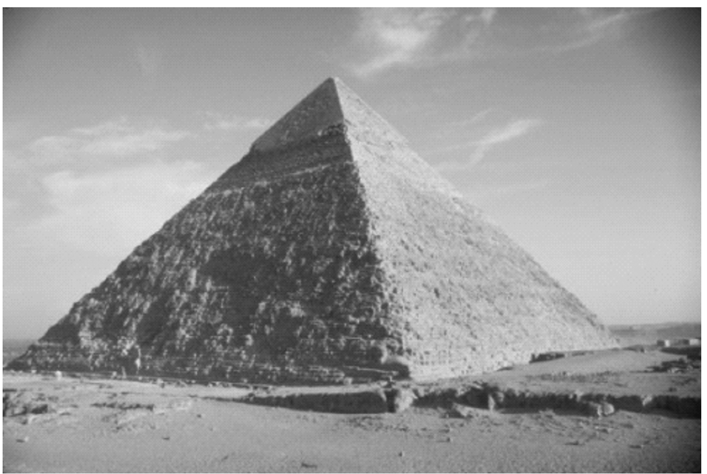
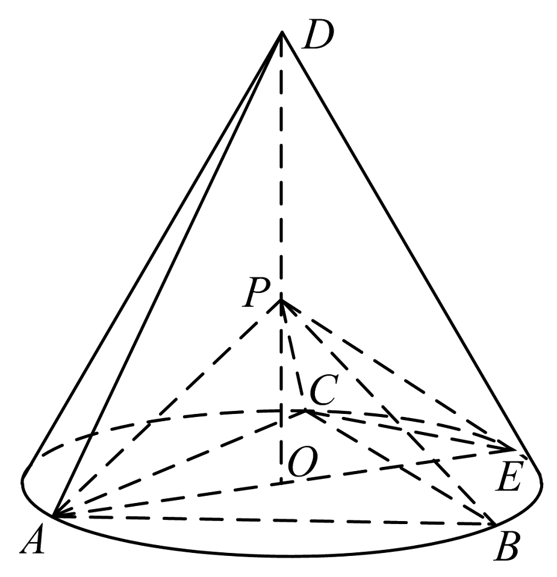
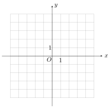
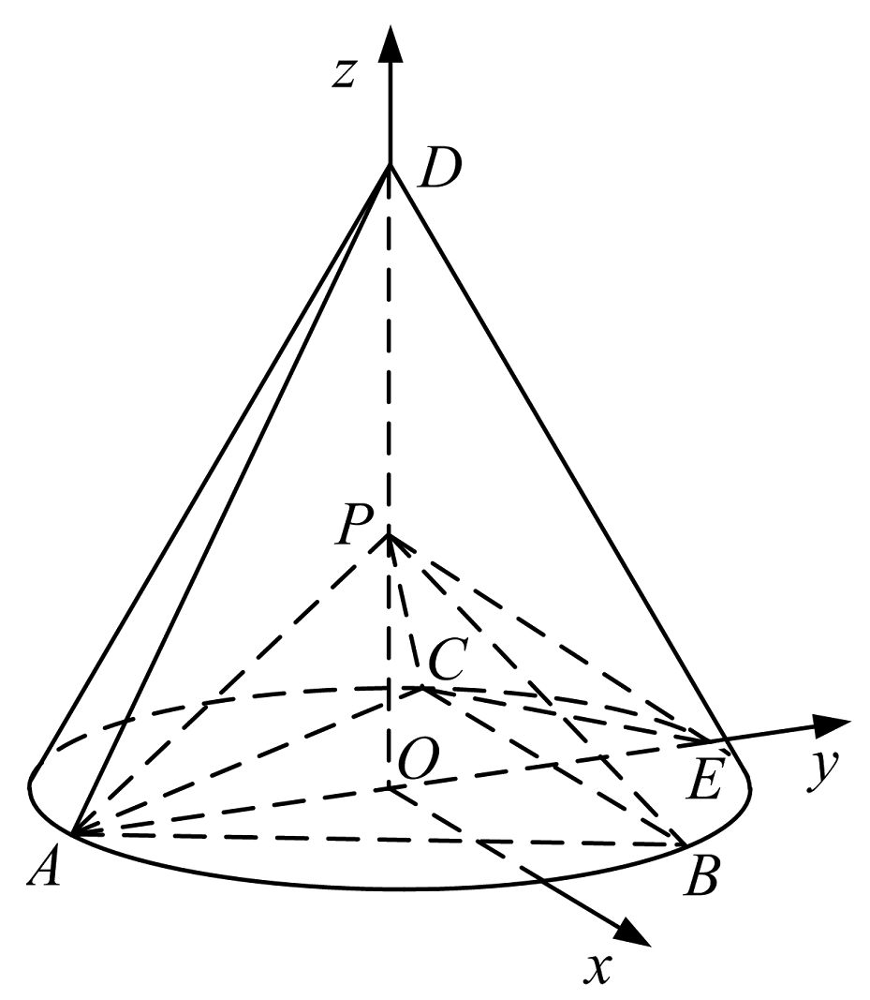
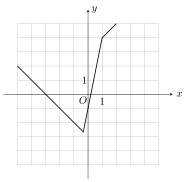

+++
title = "2020 全国Ⅰ卷理科数学试题及答案"
date = 2021-05-23T10:34:30.795Z
description = "2020 年普通高等学校招生全国统一考试理科数学（全国Ⅰ卷）"
draft = false
tags = [ "高中数学", "高考答案" ]
categories = [ "高中数学" ]
+++

  

2020 年普通高等学校招生全国统一考试

理科数学（全国Ⅰ卷）

本试卷 5 页，23 小题（含选考题）。全卷满分 150 分。考试用时 120 分钟。

<big><b>★祝考试顺利★</b></big>

**一、选择题：本题共 12 小题, 每小题 5 分，共 60 分。在每小题给出的四个选项中，只 有一项是符合题目要求的。**

**1.** 若 $z=1+i$，则 $|z^2-2z|=$

A.$0$　　B.$1$　　C.$\sqrt{2}$　　D.$2$

**2.** 设集合 $A=\{ x|x^2-4\leq0\rbrace,B=\lbrace x|2x+a\leq0\}$，且 $A\cap B=\{x|-2\leq x\leq1\}$，则 $a=$

A.$-4$　　B.$-2$　　C.$2$　　D.$4$

**3.** 埃及胡夫金字塔是古代世界建筑奇迹之一，它的形状可视为一个正四棱锥. 以该四棱锥的高为边长的正方形面积等于该四棱锥一个侧面三角形的面积，则其侧面三角形底边上的高与底面正方形的边长的比值为

A.$\frac{\sqrt{5}-1}{4}$

B.$\frac{\sqrt{5}-1}{2}$

C.$\frac{\sqrt{5}+1}{4}$

D.$\frac{\sqrt{5}+1}{2}$

**4.** 已知 $A$ 为抛物线 $C:y^2=2px\ (p>0)$ 上一点，点 $A$ 到 $C$ 的焦点的距离为 $12$，到 $y$ 轴的距离为 $9$，则 $p=$

A.$2$　　B.$3$　　C.$6$　　D.$9$

**5.** 某校一个课外学习小组为研究某作物种子的发芽率 $y$ 和温度 $x$（单位：$\mathrm{^{\circ}C}$）的关系，在 $20$ 个不同的温度条件下进行种子发芽实验，由实验数据 $(x_{i},y_{i})\ (i=1,2,\cdots,20)$ 得到下面的散点图：

由此散点图，在 $10\mathrm{^{\circ}C}$ 至 $40\mathrm{^{\circ}C}$ 之间，下面四个回归方程类型中最适宜作为发芽率 $y$ 和温度 $x$ 的回归方程类型的是

A.$y=a+bx$

B.$y=a+bx^2$

B.$y=a+b\mathrm{e}^x$

D.$y=a+b\ln x$

**6.** 函数 $f(x)=x^4-2x^3$ 的图像在点 $(1,f(1))$ 处的切线方程为

A.$y=-2x-1$

B.$y=-2x+1$

C.$y=2x-3$

D.$y=2x+1$

**7.** 设函数 $f(x)=\cos(\omega x+\frac{\pi}{6})$)在 $[-\pi$，$\pi]$ 的图像大致如下图，则 $f(x)$ 的最小正周期为

A.$\frac{10\pi}{9}$

B.$\frac{7\pi}{6}$

C.$\frac{4\pi}{3}$

D.$\frac{3\pi}{2}$

**8.** $\left(x+\frac{y^2}{x}\right)(x+y)^5$ 的展开式中 $x^3y^3$ 的系数为

A.$5$　　B.$10$　　C.$15$　　D.$20$

**9.** 已知 $\alpha\in(0,\pi)$，且 $3\cos2\alpha-8\cos\alpha=5$，则 $\sin\alpha=$

A.$\frac{\sqrt{5}}{3}$　　B.$\frac{2}{3}$　　C.$\frac{1}{3}$ 　D.$\frac{\sqrt{5}}{9}$

**10.** 已知 $A,B,C$ 为球 $O$ 的球面上的三个点，$\odot O_1$ 为 $\triangle ABC$ 的外接圆. 若 $\odot O_1$ 的面积为 $4\pi$，$AB=BC=AC=OO_1$，则球 $O$ 的表面积为

A.$64\pi$　　B.$48\pi$　　C.$36\pi$　　D.$32\pi$

**11.** 已知 $\odot M:x^2+y^2-2x-2y-2=0$，直线 $l:2x+y+2=0$，$P$ 为 $l$ 上的动点. 过点 $P$ 作 $\odot M$ 的切线 $PA$，$PB$，切点为 $A$，$B$，当 $|PM|\cdot|AB|$ 最小时，直线 $AB$ 的方程为

A.$2x-y-1=0$　　B.$2x+y-1=0$　　C.$2x-y+1=0$　　D.$2x+y+1=0$

**12.** 若 $2^a+\log_2a=4^b+2\log_4b$，则

A.$a>2b$ B.$a<2b$ C.$a>b^2$ D.$a<b^2$

二、填空题：本题共 4 小题，每小题 5 分，共 20 分。

**13.** 若 $x,y$ 满足约束条件 $\left\lbrace\begin{aligned}&2x+y-2\leq0\\&x-y-1\geq0\\&y+1\geq0\end{aligned}\right.$ 则 $z=x+7y$ 的最大值为 $\underline{\qquad}$.

**14.** 设 $\bm a,\bm b$ 为单位向量，且 $|\bm a+\bm b|=1$，则 $|\bm a-\bm b|=\underline{\qquad}$.

**15.** 已知 $F$ 为双曲线 $C:\frac{x^2}{a^2}-\frac{y^2}{b^2}=1\ (a>0,b>0)$ 的右焦点，$A$ 为 $C$ 的右顶点，$B$ 为 $C$ 上的点，且 $BF$ 垂直于 $x$ 轴. 若 $AB$ 的斜率为 $3$，则 $C$ 的离心率为 $\underline{\qquad}$.

**16.** 如图，在三棱锥 $P-ABC$ 的平面展开图中，$AC=1$，$AB=AD=\sqrt{3}$，$AB\perp AC$，$AB\perp AD$，$\angle CAE=30^{\circ}$，则 $\cos\angle FCD=\underline{\qquad}$.

**三、解答题：共 70 分。解答应写出文字说明、证明过程或演算步骤。第 17~21 题为必考题，每个试题考生都**

必须作答。第 22、23 题为选考题，考生根据要求作答。

（一）必考题：共 60 分。

**17.** （12 分）

$\{a_{n}\}$ 是公比不为 $1$ 的等比数列，$a_1$ 为 $a_2,a_3$ 的等差中项.

（1）求 $\{a_{n}\}$ 的公比；

（2）若 $a_1=1$，求数列 $\{na_{n}\}$ 的前 $n$ 项和.

**18.** （12 分）

如图，$D$ 为圆锥的顶点，$0$ 是圆锥底面的圆心，$AE$ 为底面直径，$AE=AD$. $\triangle ABC$ 是底面的内接正三角形，$P$ 为 $DO$ 上一点，$PO=\frac{\sqrt{6}}{6}DO$.

（1）证明：$PA\perp$ 平面 $PBC$；

（2）求二面角 $B-PC-E$ 的余弦值.

**19.** （12 分）

甲、乙、丙三位同学进行羽毛球比赛，约定赛制如下：

累计负两场者被淘汰；比赛前抽签决定首先比赛的两人，另一人轮空；每场比赛的胜者与轮空者进行下场比赛，负者下一场轮空，直至有一人被淘汰；当一人被淘汰后，剩余的两人继续比赛，直至其中一人被淘汰，另一人最终获胜，比赛结束.

经抽签，甲、乙首先比赛，丙轮空. 设每场比赛双方获胜的概率都为 $\frac{1}{2}$.

（1）求甲连胜四场的概率；

（2）求需要进行第五场比赛的概率；

（3）求丙最终获胜的概率.

**20.** （12 分）

已知 $A,B$ 分别为椭圆 $E:\frac{x^2}{a^2}+y^2=1\ (a>1)$，的左、右顶点，$G$ 为 $E$ 的上顶点，$\overrightarrow{AG}\cdot\overrightarrow{GB}=8$. $P$ 为直线 $x=6$ 上的动点，$PA$ 与 $E$ 的另一交点为 $C$，$PB$ 与 $E$ 的另一交点为 $D$.

（1）求 $E$ 的方程；

（2）证明：直线 $CD$ 过定点

**21.** （12 分）

已知函数 $f(x)=e^{x}+ax^2-x$.

（1）当 $a=1$ 时，讨论 $f(x)$ 的单调性；

（2）当 $x\geq0$ 时 $f(x)\geq\frac{1}{2}x^3+1$，求 $a$ 的取值范围

**（二）选考题：共 10 分。请考生在第 22、23 题中任选一题作答。如果多做，则按所做的第一题计分。**

**22.** \[选修 4-4：坐标系与参数方程\]（10 分）

在直角坐标系 $xOy$ 中，曲线 $C_1$，的参数方程为 $\left\{\begin{aligned}&x=\cos^k t\\&y=\sin^k t\end{aligned}\right.$（$t$ 为参数）. 以坐标原点为极点，$x$ 轴正半轴为极轴建立极坐标系，曲线 $C_2$ 的极坐标方程为

$$
4p\cos\theta-16p\sin\theta+3=0
$$

（1）当 $k=1$ 时，$C_1$ 是什么曲线

（2）当 $k=4$ 时，求 $C_1$$C_2$ 的公共点的直角坐标.

**23.** \[选修 4-5：不等式选讲\]（10 分）

已知函数 $f(x)=|3x+1|-2|x-1|$.

（1）画出 $y=f(x)$ 的图像；

（2）求不等式 $f(x)>f(x+1)$ 的解集.

## 理科数学试题参考答案

一、选择题

**1.** $D$  
**2.** $B$  
**3.** $C$  
**4.** $C$  
**5.** $D$  
**6.** $B$  
**7.** $C$  
**8.** $C$  
**9.** $A$  
**10.** $A$  
**11.** $D$  
**12.** $B$

二、填空题

**13.** $1$

**14.** $\sqrt{3}$

**15.** $2$

**16.** $-\frac{1}{4}$

三、解答题

**17.** 解：

（1）设 $\lbrace a_{n}\rbrace$ 的公比为 $q$，由题设得 $2a_1=a_2+a_3$，$2a_1=a_1q+a_1q^2$.

所以 $q^2+q-2=0$，解得 $q=1$（舍去），$q=-2$.

故 $\lbrace a_{n}\rbrace$ 的公比为 $-2$.

（2）记 $S_{n}$ 为 $\lbrace na_{n}\rbrace$ 的前 $n$ 项和. 由（1）及题设可得 $a_{n}=(-2)^{n-1}$. 所以

$S_{n}=1+2\times(-2)+\cdot s+n\times(-2)^{n-1}$，

$-2S_{n}=-2+2\times(-2)^2+\cdot s+(n-1)\times(-2)^{n-1}+n\times(-2)^{n}$

可得

$$
\begin{aligned}
S_{n} &= 1+(-2)+(-2)^2+\cdot s+(-2)^{n-1}-n\times(-2) \\
&= \frac{1-(-2)^{n}}{3}-n\times(-2)^{n} \\
\end{aligned}
$$

所以 $S_{n}=\frac{1}{9}-\frac{(3n+1)(-2)^{n}}{9}$.

**18.** 解：

（1）设 $DO=a$，由题设可得 $PO=\frac{\sqrt{6}}{6}a$，$AO=\frac{\sqrt{3}}{3}a$，$AB=a$，

$PA=PB=PC=\frac{\sqrt{2}}{2}a$.

因此 $PA^2+PB^2=AB^2$，从而 $PA\perp PB$.

又 $PA^2+PC^2=AC^2$，故 $PA\perp PC$.

所以 $PA\perp$ 平面 $PBC$.

（2）以 $0$ 为坐标原点，$\overrightarrow{OE}$ 的方向为 $y$ 轴正方向，$|\overrightarrow{OE}|$ 为单位长，建立如图所示的空间直角坐标系$O-xyz$.

由题设可得 $E(0,1,0)$，$A(0$，$-1,0)$，$C(-\frac{\sqrt{3}}{2},\frac{1}{2},0)$，$P(0,0,\frac{\sqrt{2}}{2})$.

所以 $\overrightarrow{EC}=(-\frac{\sqrt{3}}{2},-\frac{1}{2},0)$，$\overrightarrow{EP}=(0,-1,\frac{\sqrt{2}}{2})$.

设 $\bm m=(x,y,z)$ 是平面 $PCE$ 的法向量，则

$\left\{\begin{aligned}&\bm m\cdot\overrightarrow{EP}=0\\&\bm m\cdot EC=0 \end{aligned}\right.$，即 $\left\{\begin{aligned}&-y+\frac{\sqrt{2}}{2}z=0\\ &-\frac{\sqrt{3}}{2}x-\frac{1}{2}y=0 \end{aligned}\right.$

可取 $\bm m=(-\frac{\sqrt{3}}{3},1,\sqrt{2})$

由（1）知 $\overrightarrow{AP}=(0,1,\frac{\sqrt{2}}{2})$ 是平面 $PCB$ 的一个法向量，记 $n=\overrightarrow{AP}$，

则 $\cos\left<\bm n,\bm m\right> =\frac{\bm n\cdot\bm m}{|\bm n|\cdot|\bm m|}=\frac{2\sqrt{5}}{5}$.

所以二面角 $B-PC-E$ 的余弦值为 $\frac{2\sqrt{5}}{5}$.

**19.** 解：

（1）甲连胜四场的概率为 $\frac{1}{16}$.

（2）根据赛制，至少需要进行四场比赛，至多需 $\frac{}{}$ 要进行五场比赛.

比赛四场结束，共有三种情况：

甲连胜四场的概率为 $l\frac{1}{16}$；

乙连胜四场的概率为 $\frac{1}{16}$；

丙上场后连胜三场的概率为 $\frac{1}{8}$.

所以需要进行第五场比赛的概率为 $1-\frac{1}{16}-\frac{1}{16}-\frac{1}{8}=\frac{3}{4}$.

（3）丙最终获胜，有两种情况：

比赛四场结束且丙最终获胜的概率为 $\frac{1}{8}$；

比赛五场结束且丙最终获胜，则从第二场开始的四场比赛按照丙的胜、负、轮空结果有三种情况：

胜胜负胜，胜负空胜，负空胜胜，概率分别为 $\frac{1}{16},\frac{1}{8},\frac{1}{8}$.

因此丙最终获胜的概率为 $\frac{1}{8}+\frac{1}{16}+\frac{1}{8}+\frac{1}{8}=\frac{7}{16}$.

**20.** 解：

（1）由题设得 $A(-a,0)$，$B(a,0)$，$G(0,1)$.

$\overrightarrow{AG}=(a,1)$，$\overrightarrow{GB}=(a,-1)$. 由 $\overrightarrow{AG}\cdot\overrightarrow{GB}=8$ 得 $a^2-1=8$，即 $a=3$.

所以 $E$ 的方程为 $\frac{x^2}{9}+y^2=1$.

（2）设 $C(x_1,y_1)$，$D(x_2,y_2)$，$P(6,t)$.

若 $t\neq0$，设直线 $CD$ 的方程为 $x=my+n$，由题意可知 $-3<n<3$.

由于直线 $PA$ 的方程为 $y=\frac{t}{9}(x+3)$，所以 $y_1=\frac{t}{9}(x_1+3)$.

直线 $PB$ 的方程为 $y=\frac{t}{3}(x-3)$，所以 $y_2=\frac{t}{3}(x_2-3)$.

可得 $3y_1(x_2-3)=y_2(x_1+3)$.

由于 $\frac{x_2^2}{9}+y_2^2=1$，故 $y_2^2=-\frac{(x_2+3)(x_2-3)}{9}$. 可得 $27y_1y_2=-(x_1+3)(x_2+3)$，即

$$
(27+m^2)y_1y_2+m(n+3)(y_1+y_2)+(n+3)^2=0\quad ①
$$

将 $x=my+n$ 代人 $\frac{x^2}{9}+y^2=1$ 得

$$
(m^2+9)y^2+2mny+n^2-9=0
$$

所以 $y_1+y_2=-\frac{2mn}{m^2+9}$，$y_1y_2=\frac{n^2-9}{m^2+9}$.

代入 $①$ 式得 $(27+m^2)(n^2-9)-2m(n+3)mn+(n+3)^2(m^2+9)=0$.

解得 $n=-3$（舍去），$n=\frac{3}{2}$.

故直线 $CD$ 的方程为 $x=my+\frac{3}{2}$，即直线 $CD$ 过定点 $(\frac{J}{2},0)$.

若 $t=0$，则直线 $CD$ 的方程为 $y=0$，过点 $(\frac{3}{2},0)$.

综上，直线 $CD$ 过定点 $(\frac{3}{2},0)$.

**21.** 解：

（1）当 $a=1$ 时，$f(x)=e^{x}+x^2-x$，$f'(x)=e^{x}+2x-1$.

故当 $x\in(-\infty,0)$ 时，$f'(x)<0$；当 $x\in(0,+\infty)$ 时，$f'(x)>0$. 所以 $f(x)$ 在 $(-\infty,0)$ 单调递减，在 $(0,+\infty)$ 单调递增.

（2）$f(x)\geq\frac{1}{2}x^3+1$ 等价于 $(\frac{1}{2}x^3-ax^2+x+1)e^{-x}\leq1$.

设函数 $g(x)=(\frac{1}{2}x^3-ax^2+x+1)e^{-x}\ (x\geq0)$，则

$$
\begin{aligned}
g'(x) &= -\left(\frac{1}{2}x^3-ax^2+x+1-\frac{3}{2}x^2+2ax-1\right)e^{-x} \\
&= -\frac{1}{2}x\left[x^2-(2a+3)x+4a+2\right] e^{-x} \\
&= -\frac{1}{2}x(x-2a-1)(x-2)e^{-x} \\
\end{aligned}
$$

（i）若 $2a+1\leq0$，即 $a\leq-\frac{1}{2}$，则当 $x\in(0,2)$ 时，$g'(x)>0$. 所以 $g(x)$ 在 $(0,2)$ 单调递增，而 $g(0)=1$，故当 $x\in(0,2)$ 时，$g(x)>1$，不合题意.

（ii）若 $0<2a+1<2$，即 $-\frac{1}{2}<a<\frac{1}{2}$，则当 $x\in(0,2a+1)\cup(2,+\infty)$ 时，$g'(x)<0$；当 $x\in(2a+1,2)$ 时，$g'(x)>0$. 所以 $g(x)$ 在 $(0,2a+1)$，$(2,+\infty)$ 单调递减，在 $(2a+1,2)$ 单调递增. 由于 $g(0)=1$，所以 $g(x)\leq1$ 当且仅当 $g(2)=(7-4a)e^{-2}\leq1$，即 $a\geq\frac{7-e^2}{4}$.

所以 $\frac{7-e^2}{4}\leq a<\frac{1}{2}$ 时，$g(x)\leq1$.

（iii）若 $2a+1\geq2$，即 $a\geq\frac{1}{2}$，$g(x)\leq(\frac{1}{2}x^3+x+1)e^{-x}$.

由于 $0\in\lbrack\frac{7-e^2}{4},\frac{1}{2})$，故由（ii）可得 $(\frac{1}{2}x^3+x+1)e^{-x}\leq1$.

故当 $a\geq\frac{1}{2}$时，$g(x)\leq1$.

综上，$a$ 的取值范围是 $\lbrack\frac{7-e^2}{4},+\infty)$.

**22.** 解：

(1) 当 $k=1$ 时, $C_{1}:\left\{\begin{aligned}&x=\cos t\\&y=\sin t\end{aligned}\right.$，消去参数 $t$ 得 $x^2+y^2=1$，故曲线 $C_1$ 是圆心为坐标原点，半径为 $1$ 的圆.

(2) 当 $k=4$ 时, $C_{1}:\left\{\begin{aligned}&x=\cos^4 t\\&y=\sin^4 t\end{aligned}\right.$，消去参数 $t$ 得 $C_1$ 的直角坐标方程为 $\sqrt{x}+\sqrt{y}=1$.

$C_2$ 的直角坐标方程为 $4x-16y+3=0$.

由 $\left\lbrace\begin{aligned}&\sqrt{x}+\sqrt{y}=1\\&4x-16y+3=0\end{aligned}\right.$，解得 $\left\lbrace\begin{aligned}&x=\frac{1}{4}\\&y=\frac{1}{4}\end{aligned}\right.$.

故 $C_1$ 与 $C_2$ 的公共点的直角坐标为 $(\frac{1}{4},\frac{1}{4})$.

**23.** 解：

（1）由题设知

$$
f(x)=\begin{cases}
-x-3, x \leqslant-\frac{1}{3}\\
5 x-1,-\frac{1}{3}<x \leqslant 1\\
x+3, x>1
\end{cases}
$$

$y=f(x)$ 的图像如图所示.

（2）函数 $y=f(x)$ 的图像向左平移 $1$ 个单位长度后得到函数 $y=f(x+1)$ 的图像.

$y=f(x)$ 的图像与 $y=f(x+1)$ 的图像的交点坐标为 $(-\frac{7}{6},-\frac{11}{6})$.

由图像可知当且仅当 $x<-\frac{7}{6}$ 时，$y=f(x)$ 的图像在 $y=f(x+1)$ 的图像上方.

故不等式 $f(x)>f(x+1)$ 的解集为 $(-\infty,-\frac{7}{6})$.
