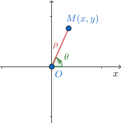
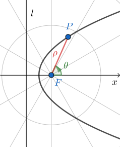
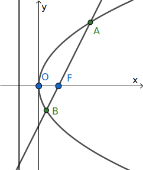
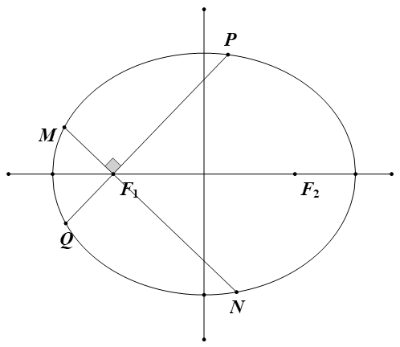
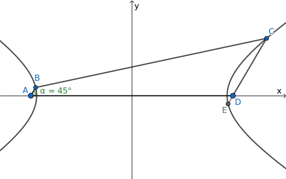
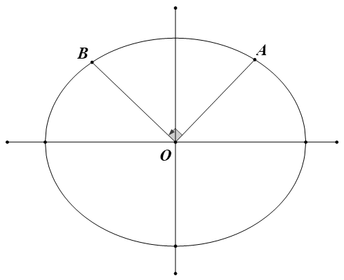

+++
title = "圆锥曲线与极坐标"
date = 2020-12-21T22:27:00
description = "介绍极坐标，推导圆锥曲线的极坐标方程，推导一些二级结论"
draft = false
tags = [ "高中数学", "解析几何", "极坐标" ]
categories = [ "高中数学" ]
+++

> 参考 https://zhuanlan.zhihu.com/p/33808071

## 极坐标

> 在平面内取一个定点 $O$，叫极点，引一条射线 $Ox$，叫做极轴，再选定一个长度单位和角度的正方向（通常取逆时针方向）。对于平面内任何一点 $M$，用 $\rho$ 表示线段 $OM$ 的长度（有时也用 $r$ 表示），$\theta$ 表示从 $Ox$ 到 $OM$ 的角度，$\rho$ 叫做点 $M$ 的极径，$\theta$ 叫做点 $M$ 的极角，有序数对 $(\rho,\theta)$ 就叫点 $M$ 的极坐标，这样建立的坐标系叫做极坐标系。

极坐标系用长度和角度取代了二维的坐标，相对于一般的直角坐标为下面的优点：

*   便于处理角度的关系
*   便于表示和计算长度

设 $M$ 为平面上的一点，它的直角坐标为 $(x,y)$，极坐标为 $(\rho,\theta)$，易得**互化公式**：

$$
\left\{
\begin{aligned}
x &= \rho \cos \theta \\
y &= \rho \sin \theta
\end{aligned}
\right.
\quad\text{or}
\left\{
\begin{aligned}
\rho^2 &= x^2+y^2 \\
\tan \theta &= \tfrac{y}{x} \ (x\neq 0)
\end{aligned}
\right.
$$

## 圆锥曲线的极坐标方程

（1）以焦点为极点

记 $|PF|=\rho$，$P$ 到准线 $l$ 的距离为 $d$，焦点到准线的距离为 $p$，由圆锥曲线的统一定义知 $\frac{\rho}{d}=e$，由图形可得 $d=p+\rho \cos\theta$，代入得 $\frac{\rho}{p+\rho \cos\theta}=e$，整理后得到**圆锥曲线的统一极坐标方程**：

$$
\rho=\frac{ep}{1-e\cos\theta}
$$

当 $e=0$ 时，轨迹为圆；$0<e<1$ 时，轨迹为椭圆；$e=1$ 时，轨迹为抛物线；$e>1$ 时，轨迹为双曲线。

（2）以坐标原点为极点

在这里只考虑椭圆与双曲线的情况，抛物线也可类比：

椭圆或双曲线的标准方程（焦点在 $x$ 轴上）为： $\frac{x^2}{a^2}\pm\frac{y^2}{b^2}=1$

代入 $x=\rho \cos\theta$，$y=\rho \sin\theta$ 得：

$\frac{\rho^2 \cos^2\theta}{a^2}\pm\frac{\rho ^2\sin^2\theta}{b^2}=1$，提取 $\rho^2$ 得：

$\displaystyle\frac{1}{\rho ^2}=\frac{\cos^2\theta}{a^2}\pm\frac{\sin^2\theta}{b^2}$，**此方程表示椭圆或双曲线的轨迹。**

取加号时，轨迹为椭圆；取减号时，轨迹为双曲线。

## 一些结论

如图，$F$ 为**圆锥曲线** $E$ 的焦点，过 $F$ 的直线交 $E$ 与 $A,B$ 两点，设直线 $AB$ 的倾斜角为 $\alpha$，则

$$
\begin{aligned}
&|AF|=\frac{ep}{1-e\cos \alpha} ,\ |BF|=\frac{ep}{1+e\cos \alpha} \\
&|AB|=\tfrac{ep}{1-e\cos \alpha}+\tfrac{ep}{1+e\cos \alpha}=\frac{2ep}{1-e^2\cos^2 \alpha}
\end{aligned}
$$

（看成以 $F$ 为极点的极坐标系，由圆锥曲线方程 $\rho=\frac{ep}{1-e\cos\theta}$，令 $\theta=\alpha$ 可得 $A$ 点的 $\rho$，即 $|AF|$；同理，令 $\theta=\alpha+\pi$ 得到 $B$ 的，再用诱导公式 $\cos(\theta+\pi)=-\cos \theta$）

当椭圆与双曲线以标准方程表示时，焦准距 $p=\frac{b^2}{c}$，离心率 $e=\frac{c}{a}$，那么

$$
\begin{aligned}
&|AF|=\frac{b^2}{a-c\cos \alpha} ,\ |BF|=\frac{b^2}{a+c\cos \alpha} \\
&|AB|=\frac{2ab^2}{a^2-c^2\cos^2\alpha}
\end{aligned}
$$

若 $\frac{|AF|}{|BF|}=\lambda$，则 $\frac{1+e\cos \alpha}{1-e\cos \alpha}=\lambda$，解出

$$
e\cos \alpha = \frac{\lambda-1}{\lambda+1}
$$

已知 $e,\lambda$ 时，可用上式求倾斜角。

特殊地，当该曲线为抛物线时，$e=1$，有

$$
\begin{aligned}
& |AF|=\frac{p}{1-\cos \alpha} \\
& |BF|=\frac{p}{1+\cos \alpha} \\
& |AB|=\frac{2p}{\sin^2 \alpha}
\end{aligned}
$$

## 应用

（1）以焦点为极点

**例 1** （2017 年全国Ⅰ卷）10．已知 $F$ 为抛物线 $C:y^2=4x$ 的焦点，过作两条互相垂直的直线 $l_1$，$l_2$，直线 $l_1$ 与 $C$ 交于 $A$、$B$ 两点，直线 $l_2$ 与 $C$ 交于 $D$、$E$ 两点，则 $|AB|+|DE|$ 的最小值为（　　）
A.16　　B.14　　C. 12　　D.10

**解** $p=2$，设直线 $AB$ 的倾斜角为 $\alpha$，则直线 $DE$ 的倾斜角为 $\alpha+\frac{\pi}{2}$

使用结论：$|AB|=\frac{2p}{\sin^2\alpha}=\frac{4}{\sin^2\alpha}$，同理 $|DE|=\frac{4}{\sin^2(\alpha+\frac{\pi}{2})}=\frac{4}{\cos^2\alpha}$

所以 $|AB|+|DE|=\frac{4}{\sin^2\alpha}+\frac{4}{\cos^2\alpha}=\left(\frac{4}{\sin^2\alpha}+\frac{4}{\cos^2\alpha}\right)\times 1=\left(\frac{4}{\sin^2\alpha}+\frac{4}{\cos^2\alpha}\right)\left(\sin^2\alpha+\cos^2\alpha\right)\geq(\frac{2}{\sin \alpha}\sin \alpha +\frac{2}{\cos\alpha}\cos \alpha)^2=(2+2)^2=16$ （柯西不等式）

**例 2** （模型来自于同济大学自招题）已知椭圆 $C:\frac{x^2}{4}+\frac{y^2}{3}=1$，过左焦点作两条相互垂直的直线，交椭圆于 $M,N,P,Q$ 四点，求四边形 $MNPQ$ 的面积的取值范围。

**解** 依题意 $e=\frac{1}{2}$，$p=3$，设直线 $PQ$ 的倾斜角为 $\alpha$，则直线 $MN$ 的倾斜角为 $\alpha+\frac{\pi}{2}$

$|PQ|=\frac{2ep}{1-e^2\cos^2\alpha}=\frac{12}{4-\cos^2\alpha}=\frac{12}{\sin^2\alpha+3}$

用 $\alpha+\frac{\pi}{2}$ 代替 $\alpha$ 得：$|MN|=\frac{12}{\cos^2\alpha+3}$

所以 $S=\frac{1}{2}|PQ||MN|=\frac{72}{(4-\cos^2\alpha)(\cos^2\alpha+3)}$

此处换元后易求得范围。

**例 3** 已知梯形 $ABCD$ 满足 $AB/\!/CD$，$\angle BAD =45^\circ$，以 $AD$ 为焦点的双曲线 $\Gamma$ 经过 $B,C$ 两点，若 $CD=7AB$，则 $\Gamma$ 的离心率为
A.$\frac{3\sqrt{2}}{4}$　　B.$\sqrt{2}$　　C.$\frac{3\sqrt{2}}{2}$　　D.$2\sqrt{2}$

**解** 延长 $CD$ 交 $\Gamma$ 于点 $E$，由对称性知 $DE=AB$，因此 $\frac{CD}{DE}=\frac{CD}{AB}=7$ 即 $\lambda=7$

运用结论 $e\cos 45^\circ = \frac{\lambda-1}{\lambda+1}$，得 $\frac{e}{\sqrt{2}}=\frac{6}{8}=\frac{3}{4}$，$e=\frac{3\sqrt{2}}{4}$

（2）以坐标原点为极点

**例 4** 已知椭圆 $C:\frac{x^2}{a^2}+\frac{y^2}{b^2}=1$，过原点作两条射线 $OA$，$OB$，交椭圆于 $A,B$，且满足：$OA\bot OB$，求证： $\frac{1}{|OA|^2}+\frac{1}{|OB|^2}$ 为定值。

**解 1** 以坐标原点为极点，$x$ 轴为极轴，建立极坐标系，则：

$x=\rho \cos\theta$，$y=\rho \sin\theta$，代入椭圆方程得：

$\frac{1}{\rho ^2}=\frac{\cos^2\theta}{a^2}+\frac{\sin^2\theta}{b^2}$

设直线 $OA$ 的倾斜角为 $\theta$，则直线 $OB$ 的倾斜角为 $\theta+\frac{\pi}{2}$

$\frac{1}{|OA| ^2}=\frac{1}{\rho_1 ^2}=\frac{\cos^2\theta}{a^2}+\frac{\sin^2\theta}{b^2}$

用 $\theta+\frac{\pi}{2}$ 代替 $\theta$ 得：

$\frac{1}{|OB| ^2}=\frac{1}{\rho_2 ^2}=\frac{\sin^2\theta}{a^2}+\frac{\cos^2\theta}{b^2}$

两式相加得： $\frac{1}{|OA|^2}+\frac{1}{|OB|^2}=\frac{\cos^2\theta+\sin^2\theta}{a^2}+\frac{\sin^2\theta+\cos^2\theta}{b^2}=\frac{1}{a^2}+\frac{1}{b^2}$，为定值

用此方法的证明极度简洁，但担心会被扣分，因此给出如下“角参”的做法：

**解 2** 记 $|OA|=m$，$|OB|=n$，$\angle AOx=\theta$，$\angle BOx=\theta+\frac{\pi}{2}$

则 $A(m\cos\theta,m\sin\theta)$，$B(n\cos(\theta+\frac{\pi}{2}),n\sin(\theta+\frac{\pi}{2}))$，即 $B(-n\sin\theta,n\cos\theta)$，代入椭圆方程得：

$\frac{1}{m^2}=\frac{\cos^2\theta}{a^2}+\frac{\sin^2\theta}{b^2}$

$\frac{1}{n^2}=\frac{\sin^2\theta}{a^2}+\frac{\cos^2\theta}{b^2}$

两式相加得： $\frac{1}{m^2}+\frac{1}{n^2}=\frac{\cos^2\theta+\sin^2\theta}{a^2}+\frac{\sin^2\theta+\cos^2\theta}{b^2}=\frac{1}{a^2}+\frac{1}{b^2}$，为定值。

其实本质上还是极坐标的思想，不过这样写就不会被当作超纲了。

在这里有人可能会想到椭圆的参数方程： $(a\cos\theta,b\sin\theta)$  
但是由于参数方程里面的 $\theta$ 并没有明确的几何意义，垂直难以表示，因此在这里不能使用！