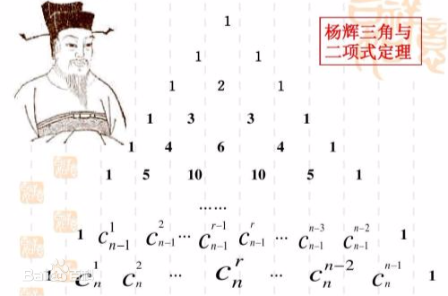

+++
title = "排列组合的一些公式及推导"
date = 2019-03-29T19:47:00
lastmod = 2021-02-22T19:05:00
description = "非常详细易懂"
draft = false
tags = [ "高中数学", "排列组合" ]
categories = [ "高中数学" ]
+++

# 绪论：加法原理、乘法原理

分类计数原理：做一件事，有 $n$ 类办法，在第 $1$ 类办法中有 $m_1$ 种不同的方法，在第 $2$ 类办法中有 $m_2$ 种不同的方法，…，在第 $n$ 类办法中有 $m_n$ 种不同的方法，那么完成这件事共有 $N=m_1+m_2+…+m_n$ 种不同的方法。

分步计数原理：完成一件事，需要分成 $n$ 个步骤，做第 $1$ 步有 $m_1$ 种不同的方法，做第 $2$ 步有 $m_2$ 种不同的方法，…，做第 $n$ 步有 $m_n$ 种不同的方法，那么完成这件事共有 $N=m_1×m_2×\cdots ×m_n$ 种不同的方法。

区别：分类计数原理是加法原理，不同的类加起来就是我要得到的总数；分步计数原理是乘法原理，是同一事件分成若干步骤，每个步骤的方法数相乘才是总数。

# 排列问题

## 排列数

从 $n$ 个不同元素种取出 $m(m\leq n)$ 个元素的所有不同排列的个数，叫做从 $n$ 个不同元素种取出 $m$ 个元素的排列数，用符号 $\mathrm{A}_n^m$ 表示。

## 排列数公式

$$
\mathrm{A}_n^m=n(n-1)(n-2)\cdots(n-m+1)=\frac{n!}{(n-m)!},\quad n,m\in \mathbb{N}^* ,\text{并且}m\leq n 
$$
（规定 $0!=1$）

推导：把 $n$ 个不同的元素任选 $m$ 个排序，按计数原理**分步进行**：

取第一个：有 $n$ 种取法；  
取第二个：有 $(n-1)$ 种取法；  
取第三个：有 $(n-2)$ 种取法；  
……  
取第 $m$ 个：有 $(n-m+1)$ 种取法；

根据分步乘法原理，得出上述公式。

## 排列数性质

$\mathrm{A}_n^m = n\mathrm{A}_{n-1}^{m-1}$ 可理解为「某特定位置」先安排，再安排其余位置。

$\mathrm{A}_n^m = m\mathrm{A}_{n-1}^{m-1} + \mathrm{A}_{n-1}^m$ 可理解为：含特定元素的排列有 $m\mathrm{A}_{n-1}^{m-1}$，不含特定元素的排列为 $\mathrm{A}_{n-1}^m$。

# 组合问题

## 组合数

从 $n$ 个不同元素种取出 $m(m\leq n)$ 个元素的所有不同组合的个数，叫做从 $n$ 个不同元素种取出 $m$ 个元素的组合数，用符号 $\mathrm{C}_n^m$ 表示。

## 组合数公式

$$
\mathrm{C}_n^m=\frac{\mathrm{A}_n^m}{\mathrm{A}_m^m}=\frac{n(n-1)(n-2)\cdots (n-m+1)}{m!}=\frac{n!}{m!(n-m)!},\quad n,m\in \mathbb{N}^* ,\text{并且}m\leq n 
$$

$$
\mathrm{C}_n^0=\mathrm{C}_n^n=1
$$

证明：利用排列和组合之间的关系以及排列的公式来推导证明。

将部分排列问题 $\mathrm{A}_n^m$ 分解为两个步骤： 

第一步，就是从 $n$ 个球中抽 $m$ 个出来，先不排序，此即组合数问题 $\mathrm{C}_n^m$；

第二步，则是把这 $m$ 个被抽出来的球排序，即全排列 $\mathrm{A}_m^m$。

根据乘法原理，$\mathrm{A}_n^m=\mathrm{C}_n^m \mathrm{A}_m^m$，那么
$$
\mathrm{C}_n^m=\frac{\mathrm{A}_n^m}{\mathrm{A}_m^m}=\frac{n(n-1)(n-2)\cdots (n-m+1)}{m!}=\frac{n!}{m!(n-m)!}
$$

## 组合数的性质

$\mathrm{C}_n^m = \mathrm{C}_n^{n-m}$ 可以理解为：将原本的每个组合都反转，把原来没选的选上，原来选了的去掉，这样就变成从 $n$ 个元素种取出 $n-m$ 个元素，显然方案数是相等的。

递推公式 $\mathrm{C}_n^m=\mathrm{C}_{n-1}^m+\mathrm{C}_{n-1}^{m-1}$ 可理解为：含特定元素的组合有 $\mathrm{C}_{n-1}^{m-1}$，不含特定元素的排列为 $\mathrm{C}_{n-1}^m$。还不懂？看下面。

**Example**

从 $1$，2，3，4，5（$n=5$）中取出 $2$（$m=2$）个元素的组合（$\mathrm{C}_n^m$）：

12 13 14 15 23 24 25 34 35 45

显然，这些组合中要么含有元素「1」，要么不含。

- 其中含有「1」的是：12 13 14 15
  
  把里面的「1」都挖掉：2 3 4 5
  
  而上面这个等价于从 $2$，3，4，5（$n-1$）中取出 $1$（$m-1$）个元素的组合。
- 其中不含「1」的是：23 24 25 34 35 45
  上面等价于从 $2$，3，4，5（$n-1$）中取出 $2$（$m$）个元素的组合。

而总方案数等于上面两种情况方案数之和，即 $\mathrm{C}_n^m=\mathrm{C}_{n-1}^m+\mathrm{C}_{n-1}^{m-1}$。

## 组合数求和公式

$$
\mathrm{C}_n^0+\mathrm{C}_n^1+\mathrm{C}_n^2+\cdots+\mathrm{C}_n^n=2^n
$$

我们感性认知一下，上面这个式子的左边表示什么呢？

把从 $n$ 个球中抽出 $0$ 个球的组合数（值为 $1$）、抽出 $1$ 个球的组合数、抽出 $2$ 个球的组合数、……、抽出 $n$ 个球的组合数相加。

换句话说，就是从 $n$ 个球中随便抽出一些不定个数球，问一共有多少种组合。

对于第 $1$ 个球，可以选，也可以不选，有 $2$ 种情况。  
对于第 $2$ 个球，可以选，也可以不选，有 $2$ 种情况。  
对于任意一个球，可以选，也可以不选，有 $2$ 种情况。

根据乘法原理，一共 $\underbrace{2\times 2\times \cdots \times 2}_{n\text{个 2 相乘}} = 2^n$ 种组合。

想要严谨的证明？数学归纳法：

1. 当 $n=1$ 时，$\mathrm{C}_1^0+\mathrm{C}_1^1=2=2^1$ 成立。
2. 假设 $n=k(k\in \mathbb{N}^*)$ 时等式成立，即
   
   $$
   \sum_{i=0}^{k} \mathrm{C}_k^i=2^n
   $$
   成立，当 $n=k+1$ 时，
   $$
   \begin{aligned}
      & \mathrm{C}_{k+1}^0 + \mathrm{C}_{k+1}^1 + \mathrm{C}_{k+1}^2 + \cdots + \mathrm{C}_{k+1}^{k} + \mathrm{C}_{k+1}^{k+1}\\
    = & \mathrm{C}_{k+1}^0+ \left(\mathrm{C}_k^0+\mathrm{C}_k^1\right) + \left(\mathrm{C}_k^1+\mathrm{C}_k^2\right) + \cdots + \left(\mathrm{C}_k^{k-1}+\mathrm{C}_k^k\right) + \mathrm{C}_{k+1}^{k+1}\\
    = & \left(\mathrm{C}_k^0 + \mathrm{C}_k^1 + \mathrm{C}_k^2 + \cdots + \mathrm{C}_k^k\right) + \left(\mathrm{C}_k^0 + \mathrm{C}_k^1 + \mathrm{C}_k^2 + \cdots + \mathrm{C}_k^k\right)\\
    = & 2 \times 2^k\\
    = & 2^{k+1}
   \end{aligned}
   $$
   等式也成立。
1. 由 $1$、$2$ 得，等式对 $n\in \mathbb{N}^*$ 都成立。

也可偷懒地用**二项式定理**证明：

$$
(a+b)^n=\sum_{k=0}^{n}\mathrm{C}_n^k a^{n-k}b^k
$$
令 $a=b=1$，就得到了
$$
\sum_{i=0}^{n} \mathrm{C}_n^i=2^n
$$

类似的公式（由 $\mathrm{C}_n^m = \mathrm{C}_n^{n-m}$ 推导）：

$$
\mathrm{C}_n^0 + \mathrm{C}_n^2 + \mathrm{C}_n^4 + \cdots = \mathrm{C}_n^1 + \mathrm{C}_n^3 + \mathrm{C}_n^5 + \cdots =2^{n-1}
$$

## 杨辉三角

这个神奇的图形和组合数、二项式定理密切相关。（图片来自百度百科）

杨辉三角可以帮助你更好地理解和记忆组合数的性质：

1. 第 $n$ 行的 $m$ 个数可表示为 $\mathrm{C}_{n-1}^{m-1}$，即为从 $n-1$ 个不同元素中取 $m-1$ 个元素的组合数。
2. 第 $n$ 行的数字有 $n$ 项。
3. 每行数字左右对称（第 $n$ 行的第 $m$ 个数和第 $n-m+1$ 个数相等，$\mathrm{C}_n^m = \mathrm{C}_n^{n-m}$），由 $1$ 开始逐渐变大。
4. 每个数等于它上方两数之和（第 $n+1$ 行的第 $i$ 个数等于第 $n$ 行的第 $i-1$ 个数和第 $i$ 个数之和，即 $\mathrm{C}_{n+1}^i=\mathrm{C}_n^i + \mathrm{C}_n^{i-1}$）。
5. $(a+b)^n$ 的展开式中的各项系数依次对应杨辉三角的第 $n+1$ 行中的每一项（二项式定理）。

---
以下来自维基百科（我只是随便贴这）

二项式系数

二项式系数可排列成帕斯卡三角形。
在数学上，二项式系数是二项式定理中各项的系数。一般而言，二项式系数由两个非负整数 $n$ 和 $k$ 为参数决定，写作 $\tbinom nk$，定义为 ${\displaystyle (1+x)^{n}}$ 的多项式展开式中，$x^{k}$ 项的系数，因此一定是非负整数。如果将二项式系数 ${\displaystyle {\binom {n}{0}},{\binom {n}{1}},\dots ,{\binom {n}{n}}}$ 写成一行，再依照 ${\displaystyle n=0,1,2,\dots}$ 顺序由上往下排列，则构成帕斯卡三角形。

二项式系数常见于各数学领域中，尤其是组合数学。事实上，可以被理解为从 $n$ 个相异元素中取出 $k$ 个元素的方法数，所以大多读作「$n$ 取 $k$」。二项式系数的定义可以推广至 $n$ 是复数的情况，而且仍然被称为二项式系数。

二项式系数亦有不同的符号表达方式，包括：$C(n,k)$、$_n\mathrm{C}_k$、$^n\mathrm{C}_k$、${\displaystyle \mathrm{C}_{n}^{k}}$、${\displaystyle \mathrm{C}_{k}^{n}}$[注 3]，其中的 $C$ 代表组合（combinations）或选择（choices）。很多计算机使用含有 $C$ 的变种记号，使得算式只占一行的空间，相同理由也发生在置换数${\displaystyle P_{k}^{n}}$，例如写作 $P( n , k )$。 

定义及概念
对于非负整数 $n$ 和 $k$，二项式系数定义为的多项式展开式中，项的系数，即 $\tbinom nk{\displaystyle (1+x)^{n}}x^{k}$

${\displaystyle (1+x)^{n}=\sum _{k=0}^{n}{\binom {n}{k}}x^{k}={\binom {n}{0} }+{\binom {n}{1}}x+\cdots +{\binom {n}{n}}x^{n}}$
事实上，若 $x$、$y$ 为交换环上的元素，则

$(x+y)^n=\sum_{k=0}^n\binom nk x^{n-k}y^k$

此数的另一出处在组合数学，表达了从 $n$ 物中，不计较次序取 $k$ 物有多少方式，亦即从一 $n$ 元素集合中所能组成 $k$ 元素子集的数量。

计算二项式系数

除展开二项式或点算组合数量之外，尚有多种方式计算的值。 $\tbinom nk$

递归公式
以下递归公式可计算二项式系数：

  $\binom nk = \binom{n-1}{k-1} + \binom{n-1}k \quad \forall n,k\in\N$

其中特别指定：

$\binom n0 = 1 \quad \forall n\in\N\cup\{0\},
\binom 0k = 0 \quad \forall k\in\N$.

此公式可由计算 (1 + X ) n −1 (1 + X ) 中的 X k 项，或点算集合{1, 2, ..., n }的 $k$ 个元素组合中包含 $n$ 与不包含 $n$ 的数量得出。

显然，如果 k  >  n，则。而且对所有 $n$，故此上述递归公式可于此等情况下中断。递归公式可用作建构帕斯卡三角形。 \tbinom nk=0\tbinom nn=1

帕斯卡三角形（杨辉三角）

有关二项式系数的恒等式

关系式

阶乘公式能联系相邻的二项式系数，例如在 $k$ 是正整数时，对任意 $n$ 有：

$$
{\binom {n+1}{k}}={\binom {n}{k}}+{\binom {n}{k-1}}
$$

$$
\binom{n}{k} = \frac{n}{k} \binom{n-1}{k-1}
$$

$$
\binom {n-1}{k} - \binom{n-1}{k-1} = \frac{n-2k}{n} \binom{n}{k}
$$

两个组合数相乘可作变换：

$$
\binom ni \binom im=\binom nm \binom {n-m}{i-m}
$$

$$
\sum_{r=0}^n \binom nr = 2^{n} 
$$

$$
{\displaystyle \sum _{r=0}^{k}{\binom {n+r-1}{r}}={\binom {n+k}{k}}}
$$

$$
{\displaystyle \sum _{r=0}^{n-k}{\frac {(-1)^{r}(n+1)}{k+r+1}}{\binom {n-k}{r} }={\binom {n}{k}}^{-1}}
$$

$$
 \sum_{r=0}^n \binom {dn}{dr}=\frac{1}{d}\sum_{r=1}^d (1+e^{\frac{2 \pi ri}{ d}})^{dn}
$$

$$
 \sum_{i=m}^n \binom {a+i}{i} = \binom {a+n+1}{n} - \binom {a+m}{m-1} 
$$

$$
 \binom {a+m}{m-1} + \binom {a+m}{m} + \binom {a+m+1}{m+1} + ... + \binom {a+n} {n} = \binom {a+n+1}{n} 
$$

$$
 F_n=\sum_{i=0}^{\infty} \binom {ni}{i}
$$

$$
 F_{n-1}+F_n=\sum_{i=0}^{\infty} \binom {n-1-i}{i}+\sum_{i=0}^{\infty} \binom {n-i }{i}=1+\sum_{i=1}^{\infty} \binom {n-i}{i-1}+\sum_{i=1}^{\infty} \binom {n-i}{i} =1+\sum_{i=1}^{\infty} \binom {n+1-i}{i}=\sum_{i=0}^{\infty} \binom {n+1-i}{ i}=F_{n+1}
$$

主条目：朱世杰恒等式

$$
\sum_{i=m}^n \binom ia = \binom {n+1}{a+1} - \binom {m}{a+1}
$$

$$
\binom {m}{a+1} + \binom ma + \binom {m+1}a ... + \binom na = \binom {n+1}{a+1}
$$

二阶求和公式

$$
{\displaystyle \sum _{r=0}^{n}{\binom {n}{r}}^{2}={\binom {2n}{n}}}
$$

$$
\sum_{i=0}^n \binom {r_1+n-1-i}{r_1-1} \binom {r_2+i-1}{r_2-1}=\binom {r_1+r_2+n-1 }{r_1+r_2-1}
$$

$$
(1-x)^{-r_1} (1-x)^{-r_2}=(1-x)^{-r_1-r_2}
$$

$$
(1-x)^{-r_1} (1-x)^{-r_2}=(\sum_{n=0}^{\infty} \binom {r_1+n-1}{r_1-1} x^ n)(\sum_{n=0}^{\infty} \binom {r_2+n-1}{r_2-1} x^n)=\sum_{n=0}^{\infty} (\sum_{ i=0}^n \binom {r_1+n-1-i}{r_1-1} \binom {r_2+i-1}{r_2-1}) x^n 
$$

$$
(1-x)^{-r_1-r_2}=\sum_{n=0}^{\infty} \binom {r_1+r_2+n-1}{r_1+r_2-1} x^n
$$
主条目：范德蒙恒等式

$$
\sum_{i=0}^k \binom ni \binom m{k-i}=\binom {n+m}k
$$

三阶求和公式

主条目：李善兰恒等式
$$
{\binom {n+k}k}^2=\sum_{j=0}^k {\binom kj}^2 \binom {n+2k-j}{2k}
$$