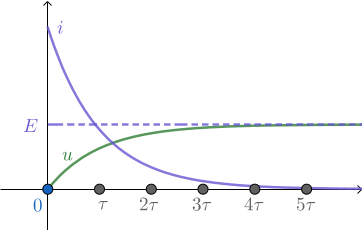

+++
title = "电容器动杆电磁感应问题"
date = 2021-03-27T10:45:41.000Z
description = "流经电容器的电流的分析与计算，电容器与动杆电磁感应结合的分析与计算"
draft = false
tags = [ "高中物理" ]
categories = [ "高中物理" ]
+++

## 电容器电流分析

> 一般高中物理很少涉及分析电容器的充电电流或放电电流。

我们知道，电容器的电容值 $C$，电荷量 $q$ 和电容器两端的电压 $u$ 满足 $q=Cu$，所以当电容器两端电压变化时，会有电流流过电容器，计算公式为 

$$i=\frac{\mathrm{d}q}{\mathrm{d}t}=C \frac{\mathrm{d}u}{\mathrm{d}t}$$

我们以这样的一个电路为例分析电容器充电电流的特点：

电动势为 $E$，内阻不计的电源与电容值为 $C$ 的电容器和阻值为 $R$ 的定值电阻串联，开关闭合后，回路中的电流如何变化？

电容器两端电压 $u$ 满足 $u=E-iR=E-RC \frac{\mathrm{d}u}{\mathrm{d}t}$

移项：$RC\frac{\mathrm{d}u}{\mathrm{d}t}=E-u$

分离变量：$\frac{1}{E-u} \mathrm{d}u = \frac{1}{RC}\mathrm{d}t$

积分：$-\ln(E-u)+\ln E=\frac{t}{RC}$

整理得

$$u=E\left(1-e^{-t/RC}\right)$$

其中的 $RC$ 被称为电容器的**充电时间常数**，记作 $\tau$，可以用来衡量电容器充电所需时间。时间达到 $5\tau$ 时，$u \approx 0.993262E$，通常可以认为此后电容器就充满了。若电路中的电阻 $R$ 小到可以忽略不计，那么就认为电容器瞬间完成了充电。

下面这幅图体现了 $u$ 和 $i$ 随时间的变化。

## 有外力无电阻

足够长的光滑平行金属导轨水平放置，间距为 $L$，左边接入电容为 $C$ 的电容器，整个装置处于垂直导轨平面向下的匀强磁场中，磁感应强度为 $B$。一个质量为 $m$ 的导体棒与导轨垂直放置且接触良好，在大小为 $F$ 的平行于导轨的恒力的作用下运动。**不计一切电阻**，初始状态下电容器的电量和金属杆的速度均为零。试分析金属棒的运动情况。

由于电阻不计，可以认为电容器充电是瞬间完成的，那么电容器两端的电压恒等于金属杆的感应电动势，即

$$u=BLv$$

根据电容器的电流特点，有

$$i=C \frac{\mathrm{d}u}{\mathrm{d}t}=BLC \frac{\mathrm{d}v}{\mathrm{d}t}=BLCa$$

对金属棒，根据牛顿第二定律

$$F-BiL=ma$$

所以

$$F-B^2L^2Ca=ma$$

$$a=\frac{F}{m+B^2L^2C}$$

加速度 $a$ 为定值，所以**金属棒做匀加速运动**。

### 拓展：电阻不可忽略

> 此内容已超出高考范围。

此时电容器两端的电压不等于金属杆的感应电动势，金属棒不再做匀加速运动。下面计算推导其运动状态。

设金属杆的电阻为 $R$，导轨无电阻，根据基尔霍夫定律有 $u+Ri=BLv$，代入 $u=\frac 1 C q$ 得

$$\frac1Cq+Ri=BLv \tag{1}$$

根据牛顿第二定律

$$m\frac{\mathrm{d}v}{\mathrm{d}t}=F-BLi$$

所以 $(1)$ 式对时间求导得

$$\frac1Ci+R\frac{\mathrm{d}i}{\mathrm{d}t}=BL\frac{\mathrm{d}v}{\mathrm{d}t}=\frac{BLF}{m}-\frac{B^2L^2}{m}i$$

整理得

$$\frac{\mathrm{d}i}{\mathrm{d}t}+\frac{m+B^2L^2C}{mRC}i=\frac{BLF}{mR}$$

记 $k=\dfrac{m+B^2L^2C}{m}$，$\tau=RC$，则上式可化为

$$\frac{\mathrm{d}i}{\mathrm{d}t}+\frac{k}{\tau}i=\frac{BLF}{mR}$$

结合初始条件 $t=0, i=0$，得

$$i=I_f(1-e^{-kt/\tau})$$

其中 $I_f=\frac{CBLF}{mk}$

从而 $$\frac{\mathrm{d}v}{\mathrm{d}t}=\frac F m-\frac{BL}{m}i=\frac{F}{mk}+\frac{BLI_f}{m}e^{-kt/\tau}$$

积分，结合 $t=0, v=0$ 得

$$v=\frac{F}{mk}t-\frac{\tau BLI_f}{mk}e^{-kt/\tau}$$
## 有初速度有电阻

废话不说，直接上方程

对金属杆，牛顿第二定律

$$-BiL=m\frac{\mathrm{d}v}{\mathrm{d}t}$$

积分，结合 $t=0,v=v_0$ 得

$$-BLq=m(v-v_0)$$

将 $q=Cu$ 代入，得

$$BLCu=m(v_0-v)$$

把 $i=-\dfrac{m}{BL} \dfrac{\mathrm{d}v}{\mathrm{d}t}$，$u=\dfrac{m(v_0-v)}{BLC}$ 代入

$$u+Ri=BLv$$

得

$$\frac{m(v_0-v)}{BLC}-\frac{mR}{BL} \frac{\mathrm{d}v}{\mathrm{d}t}=BLv$$

$$\frac{mR}{BL}\frac{\mathrm{d}v}{\mathrm{d}t}+(BL+ \frac{m}{BLC})v=\frac{mv_0}{BLC}$$

$$\frac{\mathrm{d}v}{\mathrm{d}t}+(\frac{B^2L^2C+m}{mRC})v=\frac{v_0}{RC}$$

记 $k=\dfrac{m}{B^2L^2C+m}$，$\tau=RC$，则

$$\frac{\mathrm{d}v}{\mathrm{d}t} + \frac{1}{k\tau}v=\frac{v_0}{\tau}$$

结合初始条件 $t=0, v=v_0$，得

$$v=v_0\left(k-(1-k)e^{-t/k\tau}\right)$$

最终趋于速率为 $v_0k = \dfrac{mv_0}{m+B^2L^2C}$ 的匀速运动。

### 没有电阻？

> 此内容超出高考范围。

考虑能量，初态为滑杆动能 $E_0=\frac 12mv_0^2$，末态为滑杆动能和电容器电场能 $E_f=\frac 12mv_f^2+\frac12Cu_f^2=kE_0<E_0$，损失的能量只能是通过电阻发热。

实际上，除了元件之外，任何电路都还有额外的电阻、电容、电感，一般电阻的效应最显著，所以我们只考虑电阻。如果是无电阻的超导电路，那么**电感就不可忽略**，即为 LC 震荡电路，在不考虑电磁波的情况下滑杆将做简谐振动。

简言之，无外力有初速度模型一定有电阻，没有电阻会出 bug。